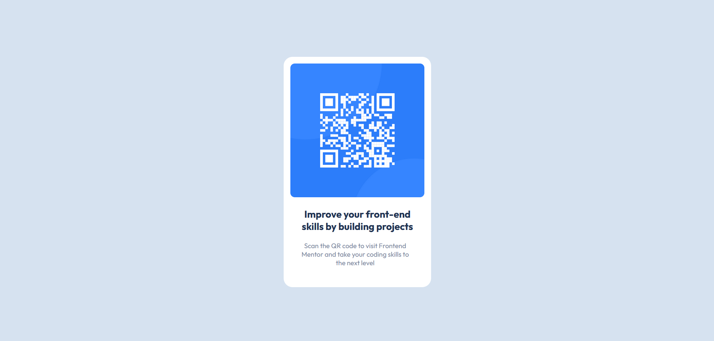

# Frontend Mentor - QR code component solution

This is a solution to the [QR code component challenge on Frontend Mentor](https://www.frontendmentor.io/challenges/qr-code-component-iux_sIO_H). Frontend Mentor challenges help you improve your coding skills by building realistic projects. 

## Table of contents

- [Overview](#overview)
  - [Screenshot](#screenshot)
  - [Links](#links)
- [My process](#my-process)
  - [Built with](#built-with)
  - [What I learned](#what-i-learned)
  - [Continued development](#continued-development)
  - [Useful resources](#useful-resources)
- [Author](#author)

## Overview

### Screenshot

### Links

- Solution URL: [Github repository](https://github.com/R3B3-888/qr-code-component)
- Live Site URL: [Github page of this project](https://r3b3-888.github.io/qr-code-component)

## My process

### Built with

- Semantic HTML5 markup
- CSS custom properties
- Flexbox

### What I learned

#### Font loading

@font-face to link a custom downloaded font
@font-face {
  font-family: Outfit;
  src: url(Outfit-VariableFont_wght.ttf);
}

Or click on https://fonts.google.com/specimen/Outfit and add Regular 400 and Bold 700,
google generate a `<link>` with Outfit font.

#### Flexbox

- display: flex
- justify-content
- align-items
- flex-direction

#### min-height

The min-height tag in vh correspond to the minimal height of an element.

### Continued development

In the future, this could be rewritten with the right dimension of the figma given by the pro version.

Or, eventually with Scss.

### Useful resources

- [Flexbox froggy](http://flexboxfroggy.com/#fr) - This helped me for learning and understanding flexbox. 

## Author

- Website - [Alexis Hoffmann](https://alexis.hoffmann.emi.u-bordeaux.fr)
- Frontend Mentor - [@R3B3-888](https://www.frontendmentor.io/profile/R3B3-888)
